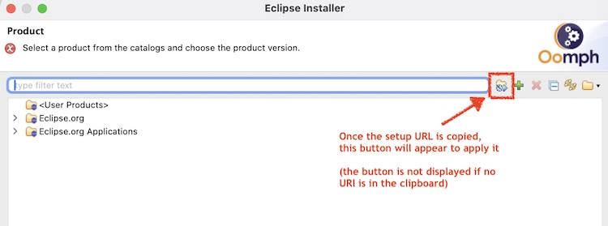
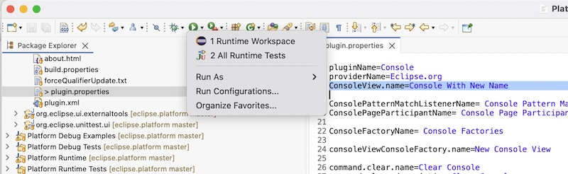

# Your Contributor Journey 🚀

Welcome to the start of an exciting journey as a contributor to the Eclipse IDE project! 🌟 Becoming a contributor is more than just writing code—it's about joining a vibrant community, learning new skills, and making a real impact. Whether you're looking to sharpen your abilities or give back to open source, you're in the right place.

This guide is split into two parts to help you get started:

1. **Part 1: Setting up your development environment** – This quick and easy step will take around 10 minutes. You’ll install everything you need to start testing modifications in a working development environment, without any constraints. It’s perfect for seeing how anyone can easily make code changes locally in Eclipse!

2. **Part 2: Contributing to the project** – Once you have a working environment, this section will walk you through setting up accounts, making contributions, and engaging with the community.

Let’s dive into each part!

## Part 1: Setting up your development environment ⚙️

This part will take around 10 minutes and will guide you through setting up a local development environment where you can test code modifications. It's designed to be simple and ensure that everyone can make changes locally in Eclipse.

### Step 1: Download the Eclipse Installer 🌟

The first step is to download the Eclipse Installer, which will help you set up your development environment. You only need to download the installer once, and it can be reused for any future projects you contribute to. Choose the appropriate version based on your operating system from the links below:

Once you've downloaded the installer, proceed to the next step to install a project to work on.

### Step 2: Install a Project to Contribute to

Once you have the Eclipse Installer, you can set up both an IDE and a project to contribute to. Eclipse provides a special "setup" file for each project, which automates the installation and configuration process. You can find the full list of available projects in the `projets.md` file. 

However, to make things easier and get you started quickly, we recommend installing the setup for the **eclipse.platform.ui** project. This will allow you to get familiar with the contribution process.

__Switching to Advanced Mode__

To install both an IDE and a project simultaneously, you need to switch the Eclipse Installer to **Advanced Mode**. Here's how:
1. Start the Eclipse Installer.
2. In the bottom-left corner of the window, click on the gear icon ⚙️ and select "Advanced Mode" from the menu. 

I will provide a screenshot to illustrate this step here.

__Installing the Project__

Once you are in Advanced Mode, follow these steps:
1. Copy the URL of the project's setup file (e.g., for **eclipse.platform.ui**, use the appropriate URL from the `projets.md` file).

Once this URl is in the clipboard the 'Apply configuration from the clipboard' button will be displayed (see below), click in the button and follow the wizard:

 

3. The installer will automatically find and select the correct setup for the project. You can then follow the steps to complete the installation.

The installation process works in two phases:
- First, the installer will set up the Eclipse IDE needed for development. When you click on finish, your IDE will start. 
- Then, once the IDE is launched, it will proceed to install the project you want to contribute to within the IDE. Just wait for the full download.

This ensures that both your development environment and the project are properly configured for you to start contributing.

> 💡 **Tip**: Sometimes, the project may not clone correctly due to network issues or slow response times. If this happens, click the 'Back' button, uncheck the 'Mirrors' option, and then continue the installation process.

__Advanced Configurations__

ℹ️ **Note**: The Eclipse Installer also provides a range of advanced configuration options that are useful when working on more complex projects. These options allow you to customize your IDE setup, manage multiple environments, and more. For further details on using the advanced features of the installer, [visit this page ->TO BE FIXED]().

### Step 3: Modify the Code

Now that you have the project set up, it's time to dive into the code! Open the project in Eclipse, find a part of the code you'd like to modify (e.g., fixing a bug or improving a feature), and make your changes. Even if you’re new to the codebase, this is a great way to get started and familiarize yourself with how everything works.

💡 **Idea**: If you're not sure what to change in the code for now, you can edit the file `eclipse.platform/debug/org.eclipse.ui.console/plugin.properties` and modify line 17 to change the name of the console view. This is a simple way to make a visible modification and see your changes in action.

### Step 4: See Your Changes by Running the Project

After making your changes, the final step is to test them! Launch a new instance of Eclipse with your modified code to see the effects of your changes. This will allow you to confirm that everything works as expected, and you can further refine your code if needed.

To run your changes:
1. Go to the **Run** menu in Eclipse.
2. Select the **Runtime Workspace** configuration that has been prepared for you.
3. Once the new Eclipse instance has launched, open the **Console** view to see the result of your changes (go to **Window** -> **Show View** -> **Console**).

You should see that the title of the Console view has been modified, reflecting the changes you made in the code.

🎉 **Congratulations!** You’ve successfully completed the first step of becoming a contributor: you’ve installed Eclipse, made code modifications, and successfully launched a modified version of the IDE. Great job! You are now ready to dive deeper into contributing to Eclipse projects.

  
    
      
      
 
    
      
      

## Part 2: Contributing to the project ⚙️

## Setting up an Eclipse and GitHub Account

Create an [Eclipse account](https://accounts.eclipse.org/) if you don't already have one. 
See the ["Eclipse Foundation Account" section](https://www.eclipse.org/projects/handbook/#contributing-account) in the Eclipse Committer Handbook.

All contributors must electronically sign the [Eclipse Contributor Agreement (ECA)](https://www.eclipse.org/legal/ECA.php)
via their [Eclipse account](https://accounts.eclipse.org/).
For more information, please see the [Eclipse Committer Handbook](https://www.eclipse.org/projects/handbook/#contributing).

To verify the Eclipse Contributor Agreement, GitHub contributions must use the 
same email address like your [Eclipse account](https://accounts.eclipse.org/).
If your GitHub account was registered with a different address, you can [add your Eclipse
email address to the account](https://github.com/settings/emails) instead.

The vast majority of projects contributing to the Eclipse IDE is hosted on [GitHub](https://github.com/).
Therefore you need a Github account to contribute to these projects.
You can also add your GitHub account name to your [Eclipse account](https://accounts.eclipse.org/) to enable automated management of access rights for Eclipse project members. 
You can do this by logging into your Eclipse account, choosing ["Edit Profile"](https://accounts.eclipse.org/user/edit) and add your GitHub account name in the social media links section.

To be able to push to your repository you should also add your [SSH public key to your GitHub account](https://github.com/settings/keys).
Pushing via `https` is not recommended.

## Submitting a contribution for a project hosted at Github

The recommended way for contributions via GitHub is to create a fork of the main project repository and to create changes only in that fork
(see [fork and pull model](https://docs.github.com/en/pull-requests/collaborating-with-pull-requests/getting-started/about-collaborative-development-models#fork-and-pull-model)
as well as [working with fork](https://docs.github.com/en/pull-requests/collaborating-with-pull-requests/working-with-forks) in the GitHub documentation).
Then you can create a pull request (PR) from your fork to propose your changes for submission into the main project repository.

See also
- https://docs.github.com/en/pull-requests/collaborating-with-pull-requests/working-with-forks/about-forks
- https://docs.github.com/en/pull-requests/collaborating-with-pull-requests/proposing-changes-to-your-work-with-pull-requests/creating-a-pull-request-from-a-fork
- https://docs.github.com/en/get-started/getting-started-with-git/managing-remote-repositories
