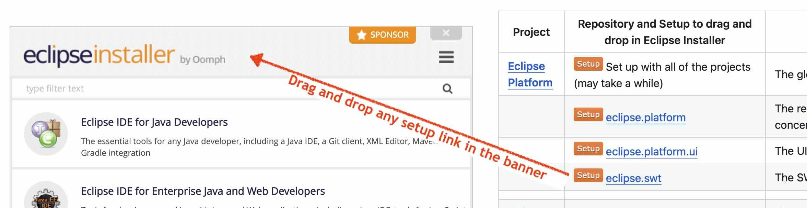

# Your Contributor Journey 🚀

Welcome to the start of an exciting journey as a contributor to the Eclipse IDE project! 🌟
Becoming a contributor is more than just writing code — it's about joining a vibrant community, learning new skills, and making a real impact.
Whether you're looking to sharpen your abilities or give back to open source, you're in the right place.

This guide is split into two parts to help you get started:

1. **Part 1: Setting up your development environment** – This quick and easy step will take around 10 minutes. You’ll install everything you need to start testing modifications in a working development environment, without any constraints. It’s perfect for seeing how anyone can easily make code changes locally in Eclipse!

2. **Part 2: Contributing to the project** – Once you have a working environment, this section will walk you through setting up accounts, making contributions, and engaging with the community.

Feel free to ask assistance if the provided information is insufficient: 

## Part 1: Setting up your development environment ⚙️

This part will guide you through setting up a local development environment where you can test code modifications. It's designed to be simple and ensures that everyone can make changes locally in Eclipse  and will take around 10 minutes.

### Step 1: Download the Eclipse Installer 🌟

The first step is to download the Eclipse Installer.
You only need to download the installer once, it can automatically updates itself, and you can reuse it for any future projects you contribute to.
Choose the appropriate version based on your operating system from the following links:

|                   | Windows                                 | Mac OS                                  | Linux                                   |
|-------------------|-----------------------------------------|-----------------------------------------|-----------------------------------------|
| **x86_64**        |  |  |  |
| **AArch64**       |  |  |  |

Once you've downloaded the installer, proceed to the next step to install a project to work on.

### Step 2: Install a Project to Contribute to

Once you have the Eclipse Installer, you can set up both an IDE and a workspace containing the source-code of the project to contribute to. Each Eclipse project provides an individual _Setup_ file, which automates the installation and configuration process. See the [Project Guide](projects.md) for a list of Eclipse IDE projects. 

**💡 Tip:** If you're on a Mac, you're using the latest version of the installer, because there used to be problems with drag&drop.

If you have not yet chosen a projec to contribute to, you can for example use the setup for **eclipse.platform.ui** . This will allow you to get familiar with the contribution process.

### Drag and drop the setup link in the banner

1. Start the Eclipse Installer.
2. Drag and drop the setup link direclty in the Eclipse Installer Banner

 

3. Switch to advanced mode (the installer will propose it as we will install an Eclipse IDE and setup a workspace with project(s) inside in one pass).
4. On the `Variables` page you can specify where your Eclipse installation, workspace and git clones will be placed
   1. The most important value is the one of the `Root install folder`.
   Without further changes your installation, workspace and git clone will be placed within the `Root install folder`, so you probably want to set it to a suitable location on your computer.
   2. Select the location of a suitable JDK on your computer.
   If you don't have one installed yet, [Adoptium](https://adoptium.net/) offers free high-quality JDKs for download. 
   > 💡 **Tip 1**: Hovering over the variable name on the left side activates a tool-tip with an explanation. 
   > 💡 **Tip 2**: The [advanced variable configuration](InstallerAdvancedOptions.md#advanced-variable-configuration) section describes more possibilities to configure all these locations.
   
   
5. Follow the remainig steps to complete the installation.

The installation process works in two phases:
- First, the installer will set up the Eclipse IDE needed for development. When you click on finish, your IDE will start. 
- Then, once the IDE is launched, it will proceed to install the project(s) you want to contribute to within the IDE. Just wait for the full download.

This ensures that both your development environment and the project are properly configured for you to start contributing.

> 💡 **Tip**: Sometimes, the project may not clone correctly due to network issues or slow response times. If this happens, click the 'Back' button, uncheck the 'Mirrors' option, and then continue the installation process.

### Step 3: Modify the Code

Now that you have the project set up, it's time to dive into the code! Open the project in Eclipse, find a part of the code you'd like to modify (e.g., fixing a bug or improving a feature), and make your changes. Even if you’re new to the codebase, this is a great way to get started and familiarize yourself with how everything works.

💡 **Idea**: If you're not sure what to change in the code for now, you can open in the `org.eclipse.ui.console` project the `plugin.properties` file and modify line 17 to change the name of the console view. This is a simple way to make a visible modification and see your changes in action.

_Of course this modification is only possible if you have chosen the **eclipse.platform.ui** setup._

### Step 4: See Your Changes by Running the Project

After making your changes, the final step is to test them! Launch a new instance of Eclipse with your modified code to see the effects of your changes. This will allow you to confirm that everything works as expected, and you can further refine your code if needed.

To run your changes:
1. Go to the **Run** menu in Eclipse.
2. Select the **Runtime Workspace** configuration that has been prepared for you.
3. Once the new Eclipse instance has launched, open the **Console** view to see the result of your changes (go to **Window** -> **Show View** -> **Console**).

You should see that the title of the Console view has been modified, reflecting the changes you made in the code.

🎉 **Congratulations!** You’ve successfully completed the first step of becoming a contributor: you’ve installed Eclipse, made code modifications, and successfully launched a modified version of the IDE. Great job! You are now ready to dive deeper into contributing to Eclipse projects.

## Part 2: Contributing to the project ⚙️

### Setting up an Eclipse and GitHub Account

Create an [Eclipse account](https://accounts.eclipse.org/) if you don't already have one. 
See the ["Eclipse Foundation Account" section](https://www.eclipse.org/projects/handbook/#contributing-account) in the Eclipse Committer Handbook.

All contributors must electronically sign the [Eclipse Contributor Agreement (ECA)](https://www.eclipse.org/legal/ECA.php)
via their [Eclipse account](https://accounts.eclipse.org/).
For more information, please see the [Eclipse Committer Handbook](https://www.eclipse.org/projects/handbook/#contributing).

To verify the Eclipse Contributor Agreement, GitHub contributions must use the 
same email address like your [Eclipse account](https://accounts.eclipse.org/).
If your GitHub account was registered with a different address, you can [add your Eclipse
email address to the account](https://github.com/settings/emails) instead.

The vast majority of projects contributing to the Eclipse IDE is hosted on [GitHub](https://github.com/).
Therefore you need a Github account to contribute to these projects.
You can also add your GitHub account name to your [Eclipse account](https://accounts.eclipse.org/) to enable automated management of access rights for Eclipse project members. 
You can do this by logging into your Eclipse account, choosing ["Edit Profile"](https://accounts.eclipse.org/user/edit) and add your GitHub account name in the social media links section.

To be able to push to your repository you should also add your [SSH public key to your GitHub account](https://github.com/settings/keys).
Pushing via `https` is not recommended.

## Submitting a contribution for a project hosted at Github

The recommended way for contributions via GitHub is to create a fork of the main project repository and to create changes only in that fork
(see [fork and pull model](https://docs.github.com/en/pull-requests/collaborating-with-pull-requests/getting-started/about-collaborative-development-models#fork-and-pull-model)
as well as [working with fork](https://docs.github.com/en/pull-requests/collaborating-with-pull-requests/working-with-forks) in the GitHub documentation).
Then you can create a pull request (PR) from your fork to propose your changes for submission into the main project repository.

See also
- https://docs.github.com/en/pull-requests/collaborating-with-pull-requests/working-with-forks/about-forks
- https://docs.github.com/en/pull-requests/collaborating-with-pull-requests/proposing-changes-to-your-work-with-pull-requests/creating-a-pull-request-from-a-fork
- https://docs.github.com/en/get-started/getting-started-with-git/managing-remote-repositories
