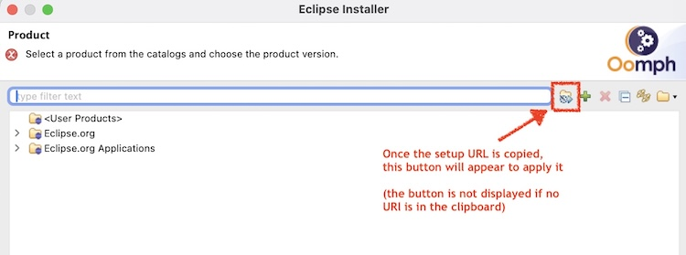

# Install with copy/paste (for macos users) 

While the Drag & Drop issue on mac OS is not fixed ([See Issue 111](https://github.com/eclipse-oomph/oomph/issues/111)), or if you prefer to use the Copy/Paste method, proceed as follow:

### Switching directly to Advanced Mode

1. Start the Eclipse Installer.
2. In the bottom-left corner of the window, click on the menu icon   
 and select "Advanced Mode" from the menu. 

### Installing the Project

1. Copy the URL of a project's setup file (see [projects.md](projects.md)) (right click on a setup button and select "Copy Link"). You can also use this one for **eclipse.platform.ui** .
2. Once this URL is in the clipboard the 'Apply configuration from the clipboard' button will be displayed (see below), click in the button and follow the wizard:

 

# Advanced variable configuration

By default the installation, workspace and all git clones are located within the `Root install folder`.
But you can also specify all locations independently as absolute paths.
To enable that select `Installed/Located in the specified absolute folder location` as value of the `Installation location rule`, `Workspace location rule` and `Git clone location rule`.
Then you can specify the desired absolute paths via the corresponding, newly displayed variables:
 

A third option, probably the most advanced one, is to select the root locations of the different location types individually.
For that choose `Located in a uniquely-named folder within the root install/workspace-container/Git-container folder` for the `Installation -`, `Workspace -` or `Git clone location rule`.
Then can specify independent roots for all installations respectively for all workspaces or all git-lones.
The installation, workspace and git clones created with you current configuration then get individual folder names within these root folders.
The folder names again have default values specified but you can also adjust them if desired.

All of the described rules can be combined arbitrarily to eventually define the location of your installation, workspace and git clones.
The full power of these advanced rules can usually only be utilized if you have multiple installations, workspaces and git clones.
For a simpler start it's therefore recommended to use the simpler options in the beginning.

In general the Eclipse Installer also provides a wide range of advanced configuration options that are useful when working on more complex projects.
These options allow you to customize your IDE setup, manage multiple environments, and more.
For further details on using the advanced features of the installer:
- [Oomph wiki page](https://wiki.eclipse.org/Oomph).
- [Oomph Authoring guide](https://wiki.eclipse.org/Eclipse_Oomph_Authoring#Shipping_your_own_index).
